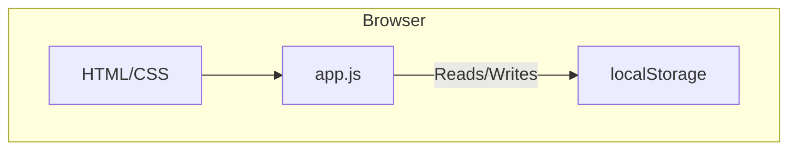

# rss‑newspaper Todo App

## Overview
The **rss‑newspaper Todo App** is a lightweight, client‑side single‑page application built with plain HTML, CSS and JavaScript.  It demonstrates how to store user data in the browser’s **localStorage**, enabling a persistent todo list without any backend or server.  The project is intentionally minimal, making it an excellent starting point for learning front‑end fundamentals, experimenting with the DOM, or extending to a more sophisticated persistence layer.

## Architecture

The app follows a very simple MVC‑like pattern:

1. **Model** – The todo list is represented as an array of objects (`{id, text, completed}`) kept in `localStorage`.
2. **View** – The UI is a static `<div id="app">` containing the input field, the list container and action buttons.  Styles are written in `style.css` and are intentionally lightweight.
3. **Controller** – All user interactions are handled by event listeners in `app.js`.  These listeners modify the model, update `localStorage`, and re‑render the view.

### Mermaid Diagram



The diagram illustrates that all logic runs inside the browser, with the only external dependency being the built‑in `localStorage` API.

## Setup

The application is purely static; no build step is required.  Simply clone the repository and open `index.html` in a browser.

```bash
# Clone the repo
git clone https://github.com/example/rss-newspaper.git
cd rss-newspaper

# Open the app
open index.html      # macOS
# or
xdg-open index.html  # Linux
# or
start index.html      # Windows
```

If you prefer to serve the files via a local HTTP server (recommended for CORS‑free behaviour), you can use a lightweight tool like Python:

```bash
# Python 3.x
python -m http.server 8000
# Then visit http://localhost:8000
```

### Environment Variables

The app does not require any environment configuration.  The only optional file is `env.example` which can be used as a template for future extensions (e.g., API base URLs).  Copy it to `.env` and modify as needed.

## Usage

1. **Add a Todo** – Type text into the “New todo” input and press **Enter** or click the **Add** button.
2. **Mark Complete** – Click the checkbox next to a todo to toggle its completion status.  Completed items are displayed with a strikethrough.
3. **Delete** – Click the trash icon to remove a todo from the list.
4. **Persist** – All changes are immediately saved to `localStorage`.  Reloading the page restores the list.

All actions are instantaneous and performed entirely on the client side.

## Tech Stack

| Layer | Technology | Why
|-------|------------|-----
| UI | HTML5, CSS3 | Native, no framework overhead
| Styling | Plain CSS | Lightweight, no build step
| Logic | Vanilla JavaScript (ES6+) | Full control over the DOM, easy to extend
| Persistence | `localStorage` | Browser‑based storage, no server
| Build | None | Static files serve as‑is

The project intentionally avoids frameworks to keep the bundle size minimal and the learning curve shallow.  If you want to experiment with a framework (React, Vue, Svelte), the same file structure can be adapted with minimal changes.

---

### Contributing

Feel free to open issues or pull requests.  All contributions are welcome, especially improvements to accessibility, performance, or additional persistence backends.

### License

MIT License – see `LICENSE`.

