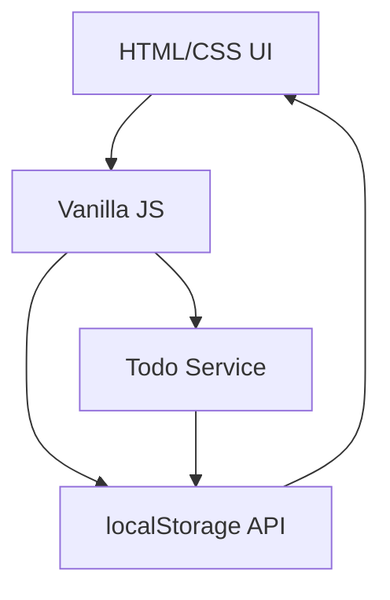

# Todo App

## Overview
A lightweight single‑page application that lets you add, complete, and delete todo items. All data is persisted in the browser’s localStorage so no backend is required.

## Stack
- Vanilla HTML/CSS for the UI
- Vanilla JavaScript for state management and DOM manipulation
- No external frameworks or libraries
- Build tool: Vite (for ES module bundling and hot reload)

## API Endpoints
The application does not expose a network API. All interactions happen locally:
- **Add** – push a new item to the in‑memory list and sync to localStorage
- **Toggle** – mark an item as completed and update localStorage
- **Delete** – remove an item from the list and localStorage

## Quickstart
```bash
# Install dependencies (uses pnpm)
pnpm install
# Run the dev server with hot reload
pnpm dev
# Build a production bundle
pnpm build
# Serve the built app
pnpm start
```

## Component Diagram


The diagram shows the UI interacting with the JavaScript logic, which in turn uses the browser’s localStorage API to persist data. The Todo Service encapsulates the core CRUD operations.