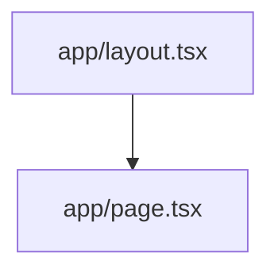

## Next.js App Router Layout

In a minimal single‑page todo app the App Router layout file (`app/layout.tsx`) provides the shared structure for all routes. It typically contains a `<html>` element, a `<body>` wrapper, and a `<main>` slot where page components are rendered. For this example the layout is intentionally lightweight, exposing a global `<div id="root">` that will host the todo list.

### Placeholder Page (`app/page.tsx`)

The placeholder page sits directly under `app/` and renders the main UI. In a vanilla‑JS setup it simply imports a script that bootstraps the todo application into the root element. The file might look like:

```tsx
export default function Page() {
  return (
    <div id="root"></div>
  );
}
```

Since the page has no dynamic data, Next.js will pre‑render it as a static HTML page, providing fast first paint.

### Routing Diagram

The following Mermaid graph visualises the routing hierarchy:



This diagram shows that every request to the root path (`/`) passes through the layout before reaching the page component.