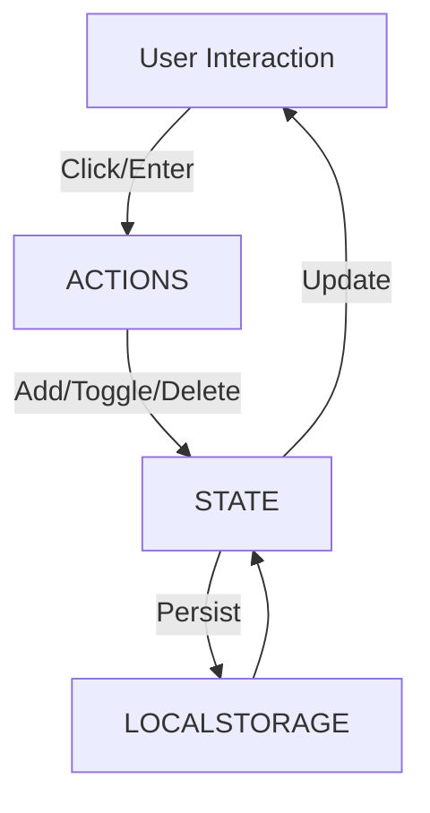

# Build a Tiny Vanilla‑JS Todo App that Persists in LocalStorage

## Hook
A single‑page todo list built with plain HTML, CSS, and JavaScript can be a lightning‑fast learning project that still feels like a real app.

## Context
Developers often prototype with React or Vue, but the overhead can obscure the core patterns of state management, DOM updates, and persistence. A vanilla‑JS implementation keeps the focus on those fundamentals and works in any browser without tooling.

## Body
### Project Structure
```
├── index.html
├── styles.css
├── app.js
├── README.md
```

### HTML & CSS
The layout uses a simple flexbox grid. The form at the top lets you add items, each todo renders as a list element with a checkbox and a delete button.

```html
<form id="todo-form">
  <input type="text" id="new-todo" placeholder="Add a todo" required>
  <button type="submit">Add</button>
</form>
<ul id="todo-list"></ul>
```

```css
body {font-family: sans-serif; max-width: 600px; margin: auto;}
#todo-list li {display: flex; justify-content: space-between; align-items: center;}
.completed {text-decoration: line-through; color: #777;}
```

### JavaScript Logic
The app keeps an array of todo objects (`{id, text, done}`) in memory and synchronises it with `localStorage` on every change.

```js
const STORAGE_KEY = 'todos';
let todos = JSON.parse(localStorage.getItem(STORAGE_KEY)) || [];
const render = () => { /* iterate and create list items */ };

document.getElementById('todo-form').addEventListener('submit', e => {
  e.preventDefault();
  const text = e.target.newTodo.value.trim();
  if (!text) return;
  todos.push({id: Date.now(), text, done: false});
  e.target.newTodo.value = '';
  persist();
  render();
});

function persist() {
  localStorage.setItem(STORAGE_KEY, JSON.stringify(todos));
}
```

### State Flow Diagram


## Conclusion
Writing a todo app in plain JavaScript reinforces the mechanics of state, event handling, and persistence without abstraction layers. The resulting code is small, maintainable, and portable across browsers.

## CTA
Try the code on your own machine, tweak the UI, and experiment with additional features like editing or drag‑and‑drop. Share your variations in the comments or on GitHub!
