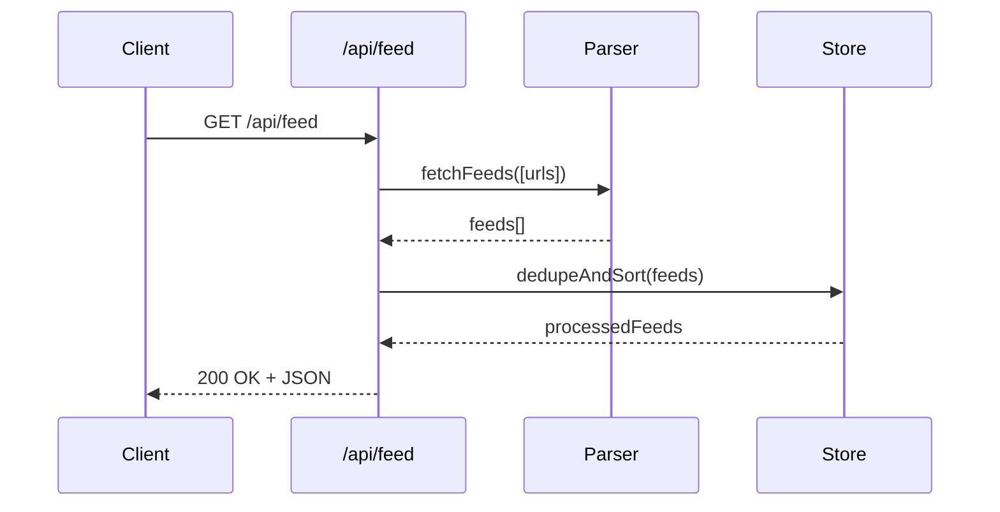

## Feed Aggregator Service Overview

The Express‑based aggregator exposes a single endpoint `GET /api/feed`. Upon request, it launches parallel RSS fetches via the `rss-parser` library, merges entries, de‑duplicates by GUID or link, sorts by publication date, and returns a JSON array to the client.

### Request Flow

### Implementation Highlights

- **Concurrent fetching**: `Promise.all` guarantees O(n) network latency regardless of the number of sources.
- **Error resilience**: Individual feed failures are logged but do not abort the entire request.
- **Cache‑friendly**: A simple in‑memory LRU cache (TTL 10 min) prevents redundant downstream requests on rapid pollers.

This architecture keeps the API thin while delegating heavy parsing to `rss-parser`, making it straightforward to extend with authentication, pagination, or webhook triggers in future iterations.