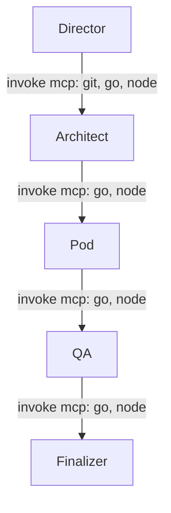

## Intro

Are you tired of juggling multiple tools in your homelab to get a single workflow running? In the early days, orchestration was a manual dance—copying config files, running scripts, and hoping the next commit doesn’t break everything. Go‑Orca evolved into a seamless toolchain integrator, letting you describe a workflow once and let the system pull in the right tools, from Git and Go compilers to Node package managers and Kubernetes operators. With a single declarative workflow you can now spin up, test, and deploy services without ever leaving the CLI.

