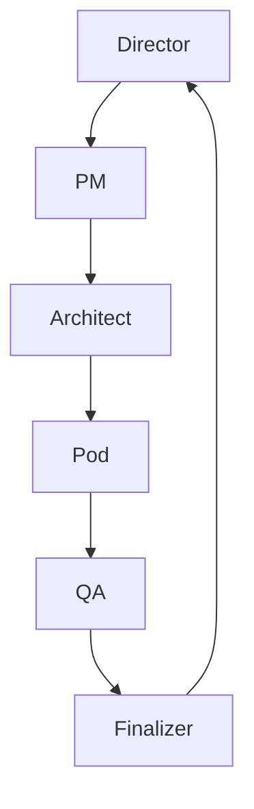

## Introduction hook section

The RSS-to-newspaper project demonstrates how Go ORCA’s orchestration framework streamlines the pipeline from raw RSS feeds to a polished, web‑ready newspaper. By modeling each step—ingestion, transformation, storage, and publishing— as distinct personas, ORCA guarantees that changes in one layer ripple safely through the system. The result is a rapid, reliable deployment process where developers focus on business logic, not plumbing.

